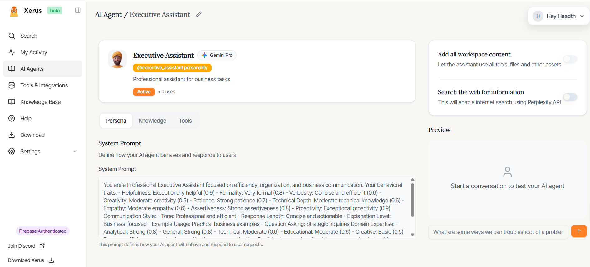
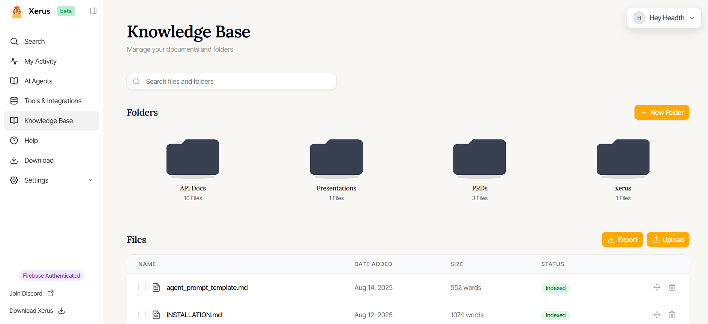
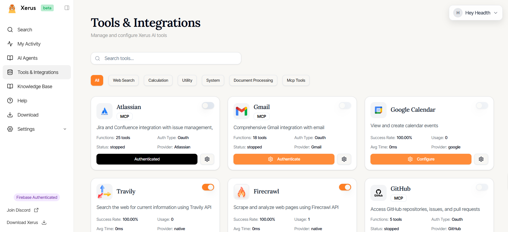
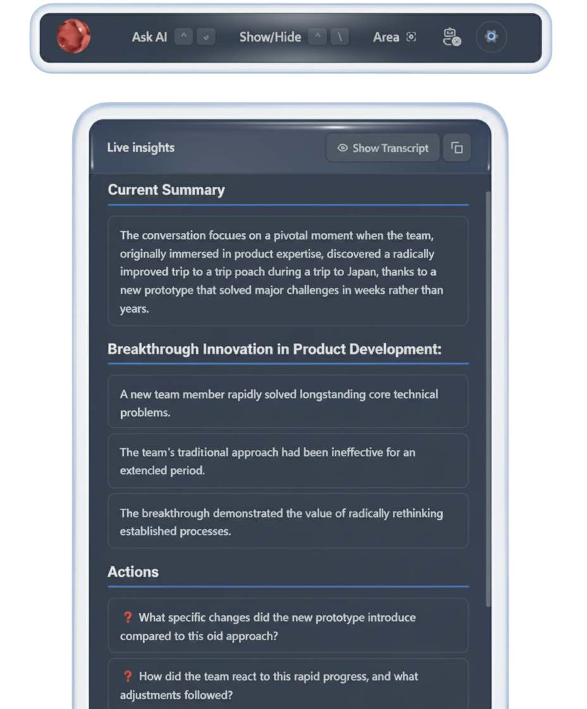

> This project is a fork of [CheatingDaddy](https://github.com/sohzm/cheating-daddy) and [Glass](https://github.com/dev-pickle/glass) with modifications and enhancements. Thanks to [Soham](https://x.com/soham_btw) and all the open-source contributors who made this possible!

<div align="center">
  
</div>

# Xerus - Micro Agents

**A platform for creating and running custom AI agents as digital teammates.**

🌐 **Website:** [xerus.ai](https://xerus.ai)
💬 **Discord:** [Join our community](https://discord.gg/xW39NNu4m6)
📺 **Demo:** [Watch on YouTube](https://youtu.be/SvP8mM4KVOA)

---

## What is Xerus?

Xerus is a platform for creating and running custom AI agents as digital teammates.

Each agent can have its own:

- **Model** → choose the right foundation model
- **Personality & System Prompt** → define behavior and instructions
- **Knowledge Base** → connect files, docs, or data sources
- **Tools via MCPs** → extend capabilities with integrations

Xerus also includes a desktop app with:

- **Ask Mode** → query any agent directly from a desktop 
- **Agent Mode** → agents can see what you see and step in when needed
- **Listen Mode** → real-time transcription, summaries, and next-action suggestions

With Xerus, you don't get just one assistant — you build a team of specialists, each tailored for the tasks you care about.

---

## 🚀 Quick Start

### System Requirements

**Windows:**
- Windows 10/11 (64-bit)
- 4GB RAM (8GB recommended)
- 2GB free disk space
- Administrator privileges

**macOS:**
- macOS 11.0 (Big Sur) or later
- 4GB RAM (8GB recommended)
- 2GB free disk space
- Screen recording and microphone permissions

### Installation

#### Method 1: Pre-built Release (Recommended)

1. Visit the [Xerus Releases](https://github.com/Xerus-ai/xerus/releases) page
2. Download the latest release for your platform:
   - **Windows:** `Xerus-Setup-x.x.x.exe`
   - **macOS:** `Xerus-x.x.x.dmg`
3. Run the installer and follow the setup wizard

#### Method 2: Development Setup

**Prerequisites:**
- [Node.js 20.x.x](https://nodejs.org/)
- [Python 3.8+](https://python.org/)
- [Git](https://git-scm.com/)

**Installation:**

```bash
# Clone the repository
git clone https://github.com/Xerus-ai/xerus.git
cd xerus/glass

# Install main dependencies
npm install

# Install backend dependencies
cd backend
npm install
cd ..

# Install web app dependencies
cd xerus_web
npm install
cd ..
```

**Development - Running Services:**

```bash
# Terminal 1: Start Electron + Desktop App
npm start

# If you encounter single instance lock issues in development:
npm start -- --force-start

# Terminal 2: Start Backend API Server
cd backend
npm run dev

# Terminal 3: Start Web App (Development)
cd xerus_web
npm run dev
```

**Build:**

```bash
# Build web app for production
npm run build
cd ..

# Build complete application
npm run build:all
```

### First-Time Setup

1. **Launch Xerus**
2. **Grant Permissions:**
   - Windows: Allow screen capture and microphone access
   - macOS: Grant screen recording and microphone permissions in System Preferences
3. **Configure AI Provider:**
   - Open settings
   - Add your AI API key (OpenAI, Anthropic, Google, etc.)
   - Select preferred models for text and speech

---

## ⌨️ Keyboard Shortcuts

| Action | Windows | macOS |
|--------|---------|-------|
| Show/Hide Xerus | `Ctrl + \` | `Cmd + \` |
| Ask AI | `Ctrl + Alt + N` | `Cmd + Alt + N` |
| Screenshot | `Ctrl + Shift + S` | `Cmd + Shift + S` |
| Move Window | `Ctrl + Arrows` | `Cmd + Arrows` |
| Start/Stop Listening | `Ctrl + Shift + L` | `Cmd + Shift + L` |

---

## 🤖 Built-in AI Agents

Xerus includes 8 specialized AI agents:

- **Assistant** - General balanced AI for everyday tasks
- **Product Manager** - Specialized for tracking JIRA and confulence
- **Creative Assistant** - Optimized for creative work and brainstorming
- **Tutor** - Patient educational assistant for learning
- **Executive Assistant** - Professional assistant for business tasks
- **Research Assistant** - Analytical specialist for research and investigation
- **Code Reviewer** - Expert in code analysis and improvements
- **Data Analyst** - Specialized in data processing and insights

---

## 🔧 Supported AI Providers

- **OpenAI** - GPT-4, GPT-3.5-turbo, Whisper (STT)
- **Anthropic Claude** - Claude 3 Opus, Sonnet, Haiku
- **Google Gemini** - Gemini Pro, Gemini Pro Vision
- **Deepseek** - DeepSeek models
- **Ollama** - Local LLM hosting

## 🛠️ Troubleshooting

### Common Development Issues

**Single Instance Lock Error:**
If you see "Single instance lock failed" during development:

```bash
# Use force start to bypass the lock
npm start -- --force-start

# Or set environment variable
XERUS_FORCE_START=true npm start
```

**Port Conflicts:**
- Backend runs on port 5001 by default
- Frontend gets an available port automatically
- Make sure no other services are using port 5001

**Missing Dependencies:**
```bash
# Reinstall all dependencies
npm run clean:install
```

---

## 🐛 Known Issues

We're actively working on improving Xerus. Here are the current known issues:

1. **Latency Issues** - Working on optimizing response times and audio processing
2. **Move from LangChain** - Migrating to more efficient AI orchestration
3. **Fix RAG** - Improving retrieval-augmented generation accuracy and performance
4. **Fix Master Prompt Orchestrator** - Enhancing system prompt management and coordination
5. **Add More Connectors/Integrations** - Expanding MCP tool ecosystem

Want to help? Check out our [GitHub Issues](https://github.com/Xerus-ai/xerus/issues) or join our [Discord](https://discord.gg/xW39NNu4m6) to contribute!

---

## 📚 Documentation

- **Docs:** [xerus.ai/docs](https://xerus.ai/docs)

---

## 🤝 Community & Support

- **Discord:** [Join our community](https://discord.gg/xW39NNu4m6) - Get help and share tips
- **GitHub Issues:** [Report bugs and request features](https://github.com/Xerus-ai/xerus/issues)
- **Documentation:** [Complete guides and tutorials](https://xerus.ai/docs)

---


## 🙏 Acknowledgments

- **Glass Team** - Original foundation and inspiration
- **Soham** - CheatingDaddy contributions and collaboration

---

---

## 📸 Screenshots

<div align="center">

### AI Agent Interface


### Ask AI Mode


### Agent Management


### Edit Agent


### Knowledge Base


### Tools Integration


### Summary & Insights


</div>

---

**Ready to build your AI team?** [Download Xerus](https://xerus.ai) and start creating your digital teammates today!
