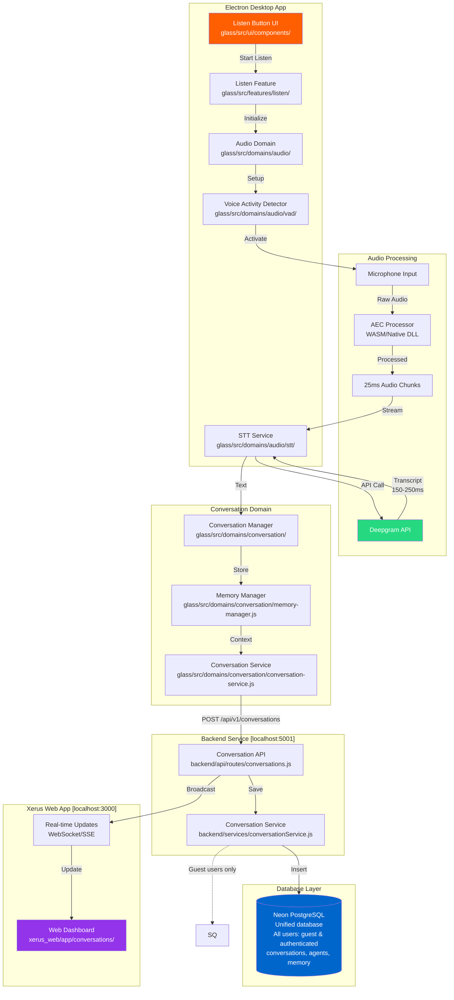
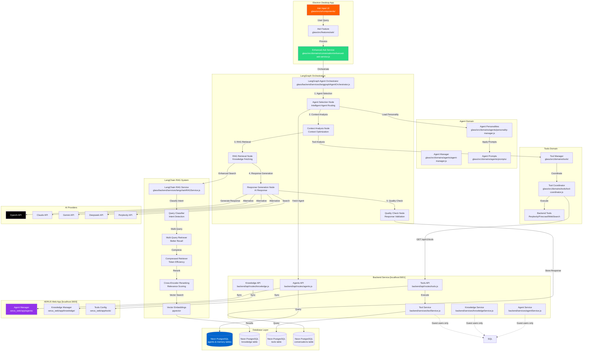

# Xerus Architecture Flow Diagrams

**Last Updated**: January 2025  
**Purpose**: Visual representation of Listen and Ask service flows across the entire architecture

---

## 🎤 Listen Service Flow

### Mermaid Diagram


### ASCII Flow Diagram
```
┌─────────────────────────── LISTEN SERVICE FLOW ───────────────────────────┐
│                                                                            │
│  ELECTRON DESKTOP APP                                                     │
│  ┌──────────────────────────────────────────────────────────────┐        │
│  │                                                              │        │
│  │  [Listen Button] ──► [Listen Feature] ──► [Audio Domain]    │        │
│  │        │                    │                    │           │        │
│  │        ▼                    ▼                    ▼           │        │
│  │  [UI Component]     [Feature Module]      [VAD Service]      │        │
│  │                                                  │           │        │
│  └──────────────────────────────────────────────────┼───────────┘        │
│                                                      │                    │
│  AUDIO PROCESSING PIPELINE                          ▼                    │
│  ┌─────────────────────────────────────────────────────────────┐        │
│  │                                                             │        │
│  │  [Microphone] ──► [AEC Processor] ──► [25ms Chunks]        │        │
│  │       │              (WASM/DLL)            │                │        │
│  │       ▼                                    ▼                │        │
│  │  [Raw Audio] ────────────────► [Deepgram STT API]          │        │
│  │                                     │                       │        │
│  │                              150-250ms latency              │        │
│  │                                     ▼                       │        │
│  │                              [Transcribed Text]             │        │
│  └─────────────────────────────────────┼───────────────────────┘        │
│                                        │                                 │
│  CONVERSATION MANAGEMENT               ▼                                 │
│  ┌─────────────────────────────────────────────────────────────┐        │
│  │                                                             │        │
│  │  [Conversation Manager] ──► [Memory Manager] ──► [Service]  │        │
│  │         │                        │                   │      │        │
│  │         └────────────────────────┼───────────────────┘      │        │
│  └──────────────────────────────────┼──────────────────────────┘        │
│                                      │                                   │
│                                      ▼                                   │
│  ═══════════════════════ HTTP POST /api/v1/conversations ═══════════════ │
│                                      │                                   │
│  BACKEND SERVICE (localhost:5001)   ▼                                   │
│  ┌─────────────────────────────────────────────────────────────┐        │
│  │                                                             │        │
│  │  [Conversation API] ──► [Conversation Service] ──► [DB]     │        │
│  │        │                        │                    │      │        │
│  │        └────────────────────────┼────────────────────┘      │        │
│  └──────────────────────────────────┼──────────────────────────┘        │
│                                      │                                   │
│                    ┌─────────────────┴─────────────────┐                │
│                    ▼                                   ▼                │
│  DATABASE LAYER                                                         │
│  ┌───────────────────────────────────────────────────────────┐        │
│  │                 Neon PostgreSQL (Unified)                 │        │
│  │   - All users: guest sessions & authenticated users       │        │
│  │   - conversations, agents, memory, knowledge base         │        │
│  │   - Credit-based access control (guest: 10, auth: 50)     │        │
│  │   - Vector embeddings (pgvector) for RAG                  │        │
│  └───────────────────────────────────────────────────────────┘        │
│                    │                                                    │
│                    ▼                                                    │
│  XERUS WEB APP (localhost:3000)                                         │
│  ┌─────────────────────────────────────────────────────────────┐        │
│  │                                                             │        │
│  │  [Real-time Updates] ──► [Web Dashboard] ──► [UI Display]  │        │
│  │    (WebSocket/SSE)         (Next.js)         (React)       │        │
│  └─────────────────────────────────────────────────────────────┘        │
│                                                                          │
└──────────────────────────────────────────────────────────────────────────┘
```

---

## 🤖 Ask Service Flow

### Mermaid Diagram


### ASCII Flow Diagram
```
┌─────────────────────────── ASK SERVICE FLOW ──────────────────────────────┐
│                                                                            │
│  ELECTRON DESKTOP APP                                                     │
│  ┌──────────────────────────────────────────────────────────────┐        │
│  │                                                              │        │
│  │  [Ask Input UI] ──► [Ask Feature] ──► [Enhanced Ask Service] │        │
│  │       │                  │                      │            │        │
│  │       ▼                  ▼                      ▼            │        │
│  │  [User Query]     [Process Query]        [Orchestration]     │        │
│  │                                                 │            │        │
│  └─────────────────────────────────────────────────┼────────────┘        │
│                                                     │                     │
│                    ┌────────────────────────────────┴──────────┐          │
│                    │                                           │          │
│                    ▼                                           │          │
│  LANGGRAPH ORCHESTRATION SYSTEM                              │          │
│  ┌──────────────────────────────────────────────────────────┐ │          │
│  │                                                          │ │          │
│  │  [LangGraph Agent Orchestrator] ──► [Workflow Nodes]    │ │          │
│  │                │                         │               │ │          │
│  │                ▼                         ▼               │ │          │
│  │  1. [Agent Selection] ──► 2. [Context Analysis]         │ │          │
│  │                │                         │               │ │          │
│  │                ▼                         ▼               │ │          │
│  │  3. [RAG Retrieval] ──► 4. [Response Gen] ──► 5. [QC]   │ │          │
│  │                │                                         │ │          │
│  │                ▼                                         │ │          │
│  │  LANGCHAIN RAG SYSTEM                                   │ │          │
│  │  ┌────────────────────────────────────────────────────┐ │ │          │
│  │  │ [Query Classifier] ──► [Multi-Query Retriever]    │ │ │          │
│  │  │          │                        │                │ │ │          │
│  │  │          ▼                        ▼                │ │ │          │
│  │  │ [Compressed Retriever] ──► [Cross-Encoder Rerank] │ │ │          │
│  │  │                               │                    │ │ │          │
│  │  │                               ▼                    │ │ │          │
│  │  │                    [Vector Embeddings - pgvector] │ │ │          │
│  │  └────────────────────────────────────────────────────┘ │ │          │
│  └──────────────────┬───────────────────────────────────────┘ │          │
│                     │                                         │          │
│                     └─────────────────────────────────────────┘          │
│               │                                                             │
│               ▼                                                             │
│  ═════════════════ POST /api/v1/agents/execute ═════════════════════════│
│               │                                                             │
│  BACKEND SERVICE (localhost:5001)                │                       │
│  ┌────────────────────────────────────────────────┴──────────────┐        │
│  │                                                              │        │
│  │  ┌─────────────────┐  ┌─────────────────┐  ┌──────────────┐ │        │
│  │  │   Agents API    │  │  LangChain RAG  │  │  Tools API   │ │        │
│  │  │       ▼         │  │    Service      │  │      ▼       │ │        │
│  │  │ LangGraph Agent │  │       ▼         │  │  Tool Svc    │ │        │
│  │  │  Orchestrator   │  │  Vector Search  │  │              │ │        │
│  │  └─────────┬───────┘  └─────────┬───────┘  └──────┬───────┘ │        │
│  │            │                    │                  │         │        │
│  └────────────┼────────────────────┼──────────────────┼─────────┘        │
│            │                  │                  │                       │
│            ▼                  ▼                  ▼                       │
│  DATABASE LAYER                                                          │
│  ┌──────────────────────────────────────────────────────────────┐        │
│  │                                                              │        │
│  │  Neon PostgreSQL (Primary Database):                           │        │
│  │  ┌──────────┐ ┌──────────┐ ┌──────────┐ ┌──────────┐      │        │
│  │  │ agents   │ │knowledge │ │  tools   │ │conversat.│      │        │
│  │  │ (8 AI    │ │(RAG data)│ │(backends)│ │(history) │      │        │
│  │  │personali.)│ │          │ │          │ │          │      │        │
│  │  └──────────┘ └──────────┘ └──────────┘ └──────────┘      │        │
│  │                                                              │        │
│  │  Guest users: Anonymous sessions with credit limits        │        │
│  └──────────────────────────────────────────────────────────────┘        │
│                                                                          │
│  TOOLS & AI PROVIDERS                                                   │
│  ┌──────────────────────────────────────────────────────────────┐        │
│  │                                                              │        │
│  │  Backend Tools:           AI Providers:                     │        │
│  │  ┌────────────┐          ┌─────────┐ ┌─────────┐          │        │
│  │  │ Perplexity │          │ OpenAI  │ │ Claude  │          │        │
│  │  │ Firecrawl  │          │ Gemini  │ │Deepseek │          │        │
│  │  │ Web Search │          │Perplexi.│ │ Ollama  │          │        │
│  │  └────────────┘          └─────────┘ └─────────┘          │        │
│  │                                                              │        │
│  └──────────────────────────────────────────────────────────────┘        │
│                                                                          │
│  XERUS WEB APP (localhost:3000)                                          │
│  ┌──────────────────────────────────────────────────────────────┐        │
│  │                                                              │        │
│  │  [Agent Manager] ──► [Knowledge Manager] ──► [Tools Config]  │        │
│  │     (CRUD)            (Upload/Search)         (Enable/Disable)│        │
│  │                                                              │        │
│  └──────────────────────────────────────────────────────────────┘        │
│                                                                          │
└──────────────────────────────────────────────────────────────────────────┘
```

---

## 📊 Performance Metrics & Data Flow

### Listen Service Timing
```
User Speaks ──► Microphone ──► AEC Processing ──► Deepgram STT ──► Display
    0ms            10ms            25ms            150-250ms       260ms
```

### Ask Service Timing (LangGraph Orchestrated)
```
User Query ──► LangGraph Orchestration ──► Agent Selection ──► Context Analysis ──► RAG Retrieval ──► Response Generation ──► Quality Check ──► Final Response
    0ms              25ms                    30ms                45ms              200-300ms           350ms                 20ms             600-720ms
```

### LangChain RAG Performance
```
Query Classification ──► Retrieval Strategy ──► Multi-Query/Compression ──► Cross-Encoder Reranking ──► Results
        15ms                   20ms                    150-200ms                      30ms              215-265ms
```

---

## 🏗️ Key Architecture Points

### 3-Component Architecture
1. **Electron Desktop** (glass/src/)
   - UI Components
   - Domain Services
   - Feature Modules

2. **Backend Service** (glass/backend/)
   - 24 RESTful APIs
   - Business Logic
   - Database Access

3. **Xerus Web App** (glass/xerus_web/)
   - Management Dashboard
   - Configuration UI
   - Real-time Updates

### Database Architecture
**Current Architecture (January 2025)**:
- **Unified Database**: Neon PostgreSQL (cloud) - All users (guest & authenticated)
- **Guest Access**: Anonymous sessions with credit-based limits (10 credits)
- **Authentication**: Firebase (JWT tokens only)
- **Embeddings**: pgvector extension for RAG functionality
- **Caching**: Redis (planned)

### Enhanced AI Architecture Components
- **LangGraph Orchestration**: Multi-agent workflow coordination with 5-node pipeline
- **LangChain RAG**: Automatic intent classification, multi-query retrieval, compression, and reranking
- **Agent Intelligence**: Capability-based routing with confidence scoring and fallback mechanisms
- **Context Optimization**: Smart context usage decisions based on query type and available resources
- **Quality Validation**: Built-in response quality checks and performance monitoring

### Legacy Microservices Domains (Still Active)
- **Audio**: STT, VAD, AEC processing
- **Tools**: Backend integration and coordination  
- **Conversation**: Memory and session management

---

## 🧠 Memory System Architecture & Information Flow

### Mermaid Diagram - Complete Memory Flow
```mermaid
flowchart TB
    subgraph "Frontend (Electron App)"
        UI[User Interface]
        FCM[Fast Context Manager<br/>Real-time Screenshots]
        AS[Ask Service<br/>Form Submissions]
        LS[Listen Service<br/>3-second Captures]
        EAS[Enhanced Ask Service<br/>Visual Memory Storage]
    end

    subgraph "Memory Processing Layer"
        subgraph "Frontend Memory Storage"
            FCM_STORE[FastContextManager Storage<br/>- Periodic screenshots (listening)<br/>- Button click screenshots<br/>- Duplicate detection<br/>- Sliding window buffer]
            FB[Feedback Buttons<br/>👍👎 User Satisfaction]
        end
        
        subgraph "Backend Memory Service"
            MS[Memory Service<br/>4-Type System]
            WM[Working Memory<br/>Immediate Context]
            EM[Episodic Memory<br/>Long-term Episodes + User Feedback]
            SM[Semantic Memory<br/>Knowledge Base]
            PM[Procedural Memory<br/>Behavioral Patterns]
        end
    end

    subgraph "Database Layer"
        NEON[(Neon PostgreSQL<br/>Unified Database<br/>All Users: Guest & Authenticated)]
        
        subgraph "Memory Tables"
            WM_TABLE[(working_memory)]
            EM_TABLE[(episodic_memory)]
            SM_TABLE[(semantic_memory)]
            PM_TABLE[(procedural_memory)]
        end
    end

    subgraph "AI Processing Integration"
        AO[Agent Orchestrator<br/>Screenshot Decision Logic]
        PROMPT[Master Prompt<br/>Context Integration]
        AI[AI Providers<br/>OpenAI/Claude/Gemini]
    end

    %% Frontend to Memory Flow
    UI -->|1. User Action| AS
    UI -->|2. Listen Mode| LS
    AS -->|3. Screenshot Capture| FCM
    LS -->|4. Periodic Capture (3s)| FCM
    UI -->|5. User Feedback| FB
    
    %% FastContextManager Storage
    FCM -->|5. Store Context| FCM_STORE
    FCM_STORE -->|6. Trigger Sources:<br/>- ask_button_click<br/>- listening_periodic<br/>- form_submit| FCM_STORE
    
    %% Enhanced Ask Service Integration
    AS -->|7. Visual Memory Processing| EAS
    EAS -->|8. AI Caption Generation| AI
    AI -->|9. Caption Response| EAS
    
    %% Backend Memory Service Storage
    EAS -->|10. Store Full Visual Data| EM
    EAS -->|11. Store Reference| WM
    AS -->|12. Direct Screenshot Storage| WM
    FB -->|13. Store User Feedback| EM
    
    %% Memory Service to Database
    WM -->|14. Working Memory Items<br/>- Screenshots (attention sinks)<br/>- Visual references<br/>- Recent context| WM_TABLE
    EM -->|15. Episodic Memory Items<br/>- Full screenshots with captions<br/>- Visual learning episodes<br/>- User feedback (👍👎)<br/>- Privacy-checked data| EM_TABLE
    SM -->|16. Semantic Memory Items<br/>- Knowledge entries<br/>- Concept extraction| SM_TABLE
    PM -->|17. Procedural Memory Items<br/>- Behavioral patterns<br/>- Usage analytics| PM_TABLE
    
    %% Database Storage
    WM_TABLE --> NEON
    EM_TABLE --> NEON
    SM_TABLE --> NEON
    PM_TABLE --> NEON
    
    WM_TABLE -.->|Guest users only| SQLITE
    EM_TABLE -.->|Guest users only| SQLITE
    SM_TABLE -.->|Guest users only| SQLITE
    PM_TABLE -.->|Guest users only| SQLITE
    
    %% AI Processing Integration
    AO -->|18. Retrieve Visual Context| WM
    AO -->|19. Check Fast Context| FCM_STORE
    AO -->|20. Retrieve User Feedback| EM
    WM -->|21. Screenshot References| AO
    FCM_STORE -->|22. Recent Screenshots| AO
    EM -->|23. Feedback Patterns| AO
    AO -->|24. Context Decision| PROMPT
    PROMPT -->|25. Enhanced Prompts| AI

    style FCM fill:#ff9500,color:#fff
    style MS fill:#26d980,color:#fff
    style NEON fill:#0066cc,color:#fff
    style EAS fill:#9333ea,color:#fff
    style AI fill:#000,color:#fff
    style FB fill:#10b981,color:#fff
```

### ASCII Memory Flow Diagram
```
┌─────────────────────── XERUS MEMORY SYSTEM FLOW ──────────────────────────┐
│                                                                            │
│  FRONTEND LAYER (Electron App)                                           │
│  ┌──────────────────────────────────────────────────────────────┐        │
│  │                                                              │        │
│  │  [User Interface] ──► [Ask Service] ──► [Listen Service]    │        │
│  │         │                  │                    │           │        │
│  │         ▼                  ▼                    ▼           │        │
│  │  [Form Submit]      [Button Click]       [3-sec Periodic] │        │
│  │         │                  │                    │           │        │
│  │         └──────────────────┼────────────────────┘           │        │
│  │                            │                                │        │
│  │                            ▼                                │        │
│  │          [Fast Context Manager] ◄─── [👍👎 Feedback]      │        │
│  │                ┌─────────────────────┐                     │        │
│  │                │ - Real-time buffer  │                     │        │
│  │                │ - Duplicate detect  │                     │        │
│  │                │ - Trigger tracking  │                     │        │
│  │                │ - Sliding window    │                     │        │
│  │                └─────────────────────┘                     │        │
│  └──────────────────────────┼───────────────────────────────────────────┘
│                               │                                           │
│                               ▼                                           │
│  ENHANCED ASK SERVICE (Visual Memory Processing)                         │
│  ┌──────────────────────────────────────────────────────────────┐        │
│  │                                                              │        │
│  │  [Screenshot] ──► [AI Caption] ──► [Privacy Check] ──► [Dual Storage] │
│  │       │               │               │                  │    │        │
│  │       └───────────────┼───────────────┼──────────────────┘    │        │
│  │                       ▼               ▼                       │        │
│  │               [AI Provider]    [Privacy Analysis]            │        │
│  │                       │               │                       │        │
│  │                       ▼               ▼                       │        │
│  │                [Caption Text]  [Clean Content]                │        │
│  └──────────────────────┼───────────────┼───────────────────────────────┘
│                          │               │                               │
│                          ▼               ▼                               │
│  ═══════════════════════ BACKEND MEMORY SERVICE ═══════════════════════ │
│                          │                                               │
│  MEMORY SERVICE (4-Type System)          │                               │
│  ┌─────────────────────────────────────────────────────────────┐        │
│  │                                                             │        │
│  │  ┌─────────────────┐  ┌─────────────────┐                 │        │
│  │  │ WORKING MEMORY  │  │ EPISODIC MEMORY │                 │        │
│  │  │ =============== │  │ =============== │                 │        │
│  │  │ - Screenshots   │  │ - Full visual   │                 │        │
│  │  │   (references)  │  │   data storage  │                 │        │
│  │  │ - Attention     │  │ - AI captions   │                 │        │
│  │  │   sinks         │  │ - Episode data  │                 │        │
│  │  │ - Recent        │  │ - Learning      │                 │        │
│  │  │   context       │  │   episodes      │                 │        │
│  │  │                 │  │ - User feedback │                 │        │
│  │  │                 │  │   (👍👎)        │                 │        │
│  │  └─────────────────┘  └─────────────────┘                 │        │
│  │                                                             │        │
│  │  ┌─────────────────┐  ┌─────────────────┐                 │        │
│  │  │ SEMANTIC MEMORY │  │PROCEDURAL MEMORY│                 │        │
│  │  │ =============== │  │ =============== │                 │        │
│  │  │ - Knowledge     │  │ - Behavioral    │                 │        │
│  │  │   entries       │  │   patterns      │                 │        │
│  │  │ - Concepts      │  │ - Usage stats   │                 │        │
│  │  │ - Facts         │  │ - Workflows     │                 │        │
│  │  └─────────────────┘  └─────────────────┘                 │        │
│  │                                                             │        │
│  └─────────────────────┼───────────────────────────────────────────────┘
│                          │                                               │
│                          ▼                                               │
│  DATABASE LAYER                                                         │
│  ┌─────────────────────────────────────────────────────────────┐        │
│  │                                                             │        │
│  │  NEON POSTGRESQL (Primary Database)                        │        │
│  │  ┌─────────────┐ ┌─────────────┐ ┌─────────────┐         │        │
│  │  │working_     │ │episodic_    │ │semantic_    │         │        │
│  │  │memory       │ │memory       │ │memory       │         │        │
│  │  │- Screenshot │ │- Full images│ │- Knowledge  │         │        │
│  │  │  refs       │ │- Captions   │ │- Concepts   │         │        │
│  │  │- Context    │ │- Episodes   │ │- Facts      │         │        │
│  │  └─────────────┘ └─────────────┘ └─────────────┘         │        │
│  │                                                             │        │
│  │  ┌─────────────┐                                           │        │
│  │  │procedural_  │                                           │        │
│  │  │memory       │                                           │        │
│  │  │- Behaviors  │           SQLITE (Guest Users Only)      │        │
│  │  │- Patterns   │           [Temporary Storage]            │        │
│  │  │- Analytics  │                                           │        │
│  │  └─────────────┘                                           │        │
│  │                                                             │        │
│  └─────────────────────┼───────────────────────────────────────────────┘
│                          │                                               │
│                          ▼                                               │
│  AI PROCESSING INTEGRATION                                              │
│  ┌─────────────────────────────────────────────────────────────┐        │
│  │                                                             │        │
│  │  [Agent Orchestrator] ──► [Visual Memory Retrieval]        │        │
│  │         │                          │                       │        │
│  │         ▼                          ▼                       │        │
│  │  [Context Decision] ──► [Master Prompt] ──► [AI Response] │        │
│  │                                                             │        │
│  └─────────────────────────────────────────────────────────────┘        │
│                                                                          │
└──────────────────────────────────────────────────────────────────────────┘
```

### Memory Storage Triggers & Flow
```
TRIGGER SOURCES                    STORAGE DESTINATION              PURPOSE
================================================================================
1. Ask Button Click              ──► FastContextManager           ──► Immediate UI context
2. Form Submission              ──► Enhanced Ask Service         ──► Visual reference
3. Listen Mode (3-sec)          ──► FastContextManager           ──► Continuous awareness
4. Visual Memory Processing     ──► Episodic Memory (full)       ──► Long-term learning
5. Attention Sink Creation      ──► Working Memory (reference)   ──► Quick retrieval
6. AI Query Processing          ──► Working Memory (screenshot)  ──► Query context
7. User Feedback (👍👎)         ──► Episodic Memory (feedback)   ──► AI improvement
```

---

## 🔌 MCP (Model Context Protocol) Integration Flow

### Mermaid Diagram - MCP Server Integration
```mermaid
flowchart TB
    subgraph "Tools Page UI (Next.js)"
        TP[Tools Page<br/>xerus_web/app/tools/page.tsx]
        TC[Tool Cards<br/>MCP Servers + Regular Tools]
        CB[Connect/Execute Buttons<br/>One-click MCP activation]
        CM[Configuration Modal<br/>OAuth & Parameter Setup]
        IC[Icon System<br/>Brand logos with CORS proxy]
    end

    subgraph "Backend API Layer"
        TA[Tools API<br/>backend/api/routes/tools.js]
        IS[Icon Server<br/>/api/v1/tools/icons/:iconName]
        MCP_EP[MCP Endpoints<br/>- /mcp-servers<br/>- /execute-mcp<br/>- /configure-mcp<br/>- /start-mcp/:serverId]
        PROXY[Next.js Icon Proxy<br/>app/api/tools/icons/[iconName]/route.ts]
    end

    subgraph "MCP Manager Service"
        MM[MCP Manager<br/>backend/services/mcp/mcpManager.js]
        SLM[Server Lifecycle Management<br/>Start/Stop/Health Monitor]
        CM_ENC[Credential Manager<br/>AES-256-GCM Encryption]
        SSE[SSE Transport<br/>Remote MCP Communication]
        CAP[Capability Detection<br/>Auto-discovery]
    end

    subgraph "MCP Servers (Remote)"
        subgraph "Production MCP Servers"
            PW[Playwright Remote<br/>Browser Testing & Automation]
            WE[Weather Remote<br/>Real-time Weather Data]
            GH[GitHub Remote<br/>Repository Management]
            GM[Gmail Remote<br/>Email Management]
            AT[Atlassian Remote<br/>Jira & Confluence Integration]
        end
        
        subgraph "Server Capabilities"
            PW_CAP[Browser automation<br/>Testing, Screenshots]
            WE_CAP[Weather data<br/>Forecasts, Location-based]
            GH_CAP[Repository access<br/>Code analysis, Issues]
            GM_CAP[Email management<br/>Automation, Search]
            AT_CAP[Issue management<br/>Project tracking, Documentation]
        end
    end

    subgraph "Database Layer"
        TC_TABLE[(Neon PostgreSQL<br/>tool_configurations<br/>MCP server configs<br/>+ icon column)]
        CRED_TABLE[(mcp_credentials<br/>Encrypted OAuth tokens<br/>+ API keys)]
        EXEC_TABLE[(tool_executions<br/>Execution logs)]
    end

    subgraph "Agent Integration"
        AO[Agent Orchestrator<br/>LangGraph Integration]
        EAS[Enhanced Ask Service<br/>MCP Tool Selection]
        TC_COORD[Tool Coordinator<br/>MCP Execution Context]
    end

    %% UI Flow
    TP -->|Display Tools| TC
    TC -->|User Action| CB
    CB -->|Configure| CM
    CB -->|Execute| MCP_EP

    %% Icon System Flow
    TC -->|Load Icons| PROXY
    PROXY -->|Fetch| IS
    IS -->|Serve with CORS| TC

    %% Backend Integration
    MCP_EP -->|Manage| MM
    MM -->|Lifecycle| SLM
    MM -->|Secure Storage| CM_ENC
    MM -->|Communication| SSE

    %% MCP Server Communication
    SSE -->|Connect| PW
    SSE -->|Connect| WE
    SSE -->|Connect| GH
    SSE -->|Connect| GM
    SSE -->|Connect| AT

    %% Capability Discovery
    PW -->|Capabilities| PW_CAP
    WE -->|Capabilities| WE_CAP
    GH -->|Capabilities| GH_CAP
    GM -->|Capabilities| GM_CAP
    AT -->|Capabilities| AT_CAP

    %% Database Operations
    MM -->|Store Config| TC_TABLE
    CM_ENC -->|Store Creds| CRED_TABLE
    MM -->|Log Execution| EXEC_TABLE

    %% Agent System Integration
    EAS -->|Tool Selection| AO
    AO -->|Execute MCP| TC_COORD
    TC_COORD -->|MCP Call| MM
    MM -->|Results| AO
    AO -->|Response| EAS

    style TP fill:#9333ea,color:#fff
    style MM fill:#26d980,color:#fff
    style TC_TABLE fill:#0066cc,color:#fff
    style AO fill:#ff5f00,color:#fff
    style SSE fill:#10b981,color:#fff
```

### ASCII MCP Integration Diagram
```
┌─────────────────────── MCP INTEGRATION FLOW ──────────────────────────────┐
│                                                                            │
│  TOOLS PAGE UI (Next.js - localhost:3000)                                │
│  ┌──────────────────────────────────────────────────────────────┐        │
│  │                                                              │        │
│  │  [Tools Page] ──► [Tool Cards] ──► [Connect/Execute Buttons] │        │
│  │       │              │                      │               │        │
│  │       ▼              ▼                      ▼               │        │
│  │  [Unified View] [Brand Icons]        [One-click MCP]        │        │
│  │                      │                      │               │        │
│  │                      ▼                      ▼               │        │
│  │              [CORS Proxy Route]    [Configuration Modal]    │        │
│  │                      │                      │               │        │
│  └──────────────────────┼──────────────────────┼───────────────┘        │
│                         │                      │                        │
│                         ▼                      ▼                        │
│  BACKEND API LAYER (Express.js - localhost:5001)                        │
│  ┌──────────────────────────────────────────────────────────────┐        │
│  │                                                              │        │
│  │  [Next.js Icon Proxy] ──► [Backend Icon Server] ──► [CORS]  │        │
│  │           │                        │                         │        │
│  │           └────────────────────────┼─────────────────────────┘        │
│  │                                    │                                  │
│  │  [MCP API Endpoints] ──────────────┘                                  │
│  │  ├── GET /mcp-servers (list available)                               │
│  │  ├── POST /execute-mcp (run operations)                              │
│  │  ├── PUT /configure-mcp (setup credentials)                          │
│  │  ├── POST /start-mcp/:serverId (start server)                        │
│  │  └── POST /stop-mcp/:serverId (stop server)                          │
│  │                    │                                                  │
│  └────────────────────┼──────────────────────────────────────────────────┘
│                       │                                                  │
│                       ▼                                                  │
│  MCP MANAGER SERVICE                                                     │
│  ┌──────────────────────────────────────────────────────────────┐        │
│  │                                                              │        │
│  │  [MCP Manager] ──► [Server Lifecycle Management]            │        │
│  │       │                    │                                │        │
│  │       ▼                    ▼                                │        │
│  │  [Credential Manager] [SSE Transport Layer]                 │        │
│  │    (AES-256-GCM)         (Remote Communication)            │        │
│  │       │                    │                                │        │
│  │       ▼                    ▼                                │        │
│  │  [Encrypted Storage] [Server Health Monitoring]            │        │
│  │                                                              │        │
│  └──────────────────┬───────────────────┬───────────────────────────────┘
│                     │                   │                               │
│                     ▼                   ▼                               │
│  DATABASE LAYER                                                         │
│  ┌─────────────────────────────────────────────────────────────┐        │
│  │                                                             │        │
│  │  Neon PostgreSQL Tables:                                   │        │
│  │  ┌────────────────┐ ┌────────────────┐ ┌─────────────────┐ │        │
│  │  │tool_configs    │ │mcp_credentials │ │tool_executions  │ │        │
│  │  │- MCP server    │ │- OAuth tokens  │ │- Execution logs │ │        │
│  │  │  configurations│ │- API keys      │ │- Performance    │ │        │
│  │  │- Icons + URLs  │ │- AES encrypted │ │  metrics        │ │        │
│  │  │- Capabilities  │ │- IV + AuthTag  │ │- Error tracking │ │        │
│  │  └────────────────┘ └────────────────┘ └─────────────────┘ │        │
│  │                                                             │        │
│  └─────────────────────┬───────────────────────────────────────────────┘
│                        │                                               │
│                        ▼                                               │
│  REMOTE MCP SERVERS (Server-Sent Events Communication)                │
│  ┌─────────────────────────────────────────────────────────────┐        │
│  │                                                             │        │
│  │  PRODUCTION MCP SERVERS:                                   │        │
│  │  ┌──────────────┐ ┌──────────────┐ ┌─────────────────────┐ │        │
│  │  │ Playwright   │ │ Weather      │ │ GitHub              │ │        │
│  │  │ Remote       │ │ Remote       │ │ Remote              │ │        │
│  │  │ ============ │ │ ============ │ │ ===================  │ │        │
│  │  │ - Browser    │ │ - Real-time  │ │ - Repository        │ │        │
│  │  │   automation │ │   weather    │ │   management        │ │        │
│  │  │ - Testing    │ │   data       │ │ - Code analysis     │ │        │
│  │  │ - Screenshots│ │ - Forecasts  │ │ - Issue tracking    │ │        │
│  │  │ - No OAuth   │ │ - Location   │ │ - OAuth required    │ │        │
│  │  └──────────────┘ └──────────────┘ └─────────────────────┘ │        │
│  │                                                             │        │
│  │  ┌──────────────┐ ┌──────────────┐                        │        │
│  │  │ Gmail        │ │ Atlassian    │                        │        │
│  │  │ Remote       │ │ Remote       │                        │        │
│  │  │ ============ │ │ ============ │                        │        │
│  │  │ - Email      │ │ - Jira       │                        │        │
│  │  │   management │ │   issues     │                        │        │
│  │  │ - Automation │ │ - Confluence │                        │        │
│  │  │ - Search     │ │   pages      │                        │        │
│  │  │ - OAuth req  │ │ - OAuth req  │                        │        │
│  │  └──────────────┘ └──────────────┘                        │        │
│  └─────────────────────┬───────────────────────────────────────────────┘
│                        │                                               │
│                        ▼                                               │
│  AGENT SYSTEM INTEGRATION                                              │
│  ┌─────────────────────────────────────────────────────────────┐        │
│  │                                                             │        │
│  │  [Enhanced Ask Service] ──► [Agent Orchestrator]           │        │
│  │            │                        │                      │        │
│  │            ▼                        ▼                      │        │
│  │  [Context Analysis] ──► [MCP Tool Selection Logic]        │        │
│  │            │                        │                      │        │
│  │            ▼                        ▼                      │        │
│  │  [Visual Memory] ──► [Tool Coordinator] ──► [MCP Execute] │        │
│  │                                     │                      │        │
│  │                                     ▼                      │        │
│  │                         [Agent Response with MCP Data]    │        │
│  └─────────────────────────────────────────────────────────────┘        │
│                                                                          │
└──────────────────────────────────────────────────────────────────────────┘
```

### MCP Integration Key Points

#### Unified Tools Interface
- **No Separate MCP Page**: MCP servers appear as tools alongside regular integrations
- **One-Click Activation**: Connect/Execute buttons automatically handle server lifecycle
- **Visual Consistency**: Brand icons with professional logos (Playwright, GitHub, etc.)
- **Real-time Status**: Live server health and connection indicators

#### Security & Credential Management
- **AES-256-GCM Encryption**: All OAuth tokens and API keys encrypted at rest
- **Secure OAuth Flow**: Standard OAuth 2.0 with automatic token refresh
- **Database Security**: Encrypted credential storage with IV and authentication tags
- **No Environment Variables**: End-users don't need to configure environment variables

#### Server Lifecycle & Communication
- **SSE Transport**: Server-Sent Events for reliable remote MCP communication
- **Health Monitoring**: Automatic server health checks and restart capabilities
- **Capability Discovery**: Automatic detection of MCP server capabilities
- **Error Recovery**: Graceful handling of server failures with user-friendly messages

#### Agent System Integration
- **Context-Aware Selection**: Agent orchestrator intelligently selects appropriate MCP tools
- **Visual Memory Integration**: Screenshots and context inform MCP tool usage decisions
- **Enhanced Ask Service**: MCP tools integrated into the main AI conversation flow
- **LangGraph Coordination**: MCP execution coordinated through the LangGraph workflow

#### Production MCP Servers
1. **Playwright Remote**: Browser automation, testing, screenshots (no OAuth required)
2. **Weather Remote**: Real-time weather data and forecasts (API key based)
3. **GitHub Remote**: Repository management, code analysis (OAuth required)
4. **Gmail Remote**: Email management and automation (OAuth required)
5. **Atlassian Remote**: Jira and Confluence integration with issue management, project tracking, and documentation (OAuth required)

#### CORS & Icon System
- **Next.js Proxy Route**: `/api/tools/icons/[iconName]/route.ts` handles CORS issues
- **Backend Icon Server**: Express endpoint serves icons with proper headers
- **Professional Branding**: Official logos for GitHub, Gmail, Playwright, Weather services
- **Caching Strategy**: 24-hour cache headers for optimal performance

---

*These diagrams represent the complete production-ready architecture as of January 2025, featuring enhanced Ask Service with agent-based conversation management, automated screenshot analysis, sophisticated 4-type memory system, integrated user feedback collection for continuous AI improvement, and comprehensive MCP (Model Context Protocol) integration for standardized AI tool connectivity.*